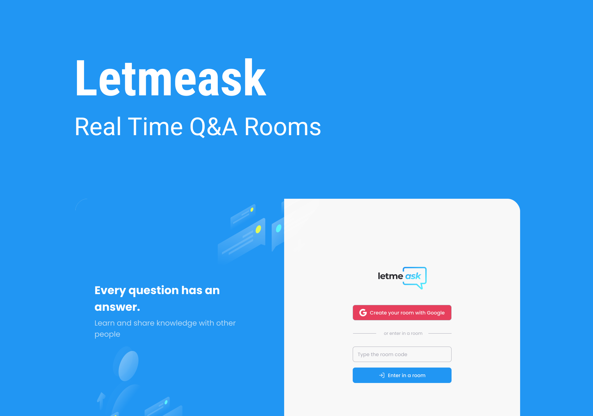

<p align="center">
  
</p>

<h1 align="center">
    
</h1>

<br>

## 🧪 Technologies

This project was developed using the following technologies:

- [Next.js](https://nextjs.org/)
- [Firebase](https://firebase.google.com/)
- [TypeScript](https://www.typescriptlang.org/)
- [Tailwind CSS](https://tailwindcss.com/)

## 🚀 Getting Started

Clone the project and navigate to the project folder.

```bash
$ https://github.com/laizeferraz/letmeask2.0.git
$ cd letmeask2.0
```

To run the development server: 
```bash
# Install the dependencies
$ npm install

# Run the project
$ npm run dev
```
The app runs on the browser in the URL http://localhost:3000.

Note: You need to create an account with [Firebase](https://firebase.google.com/) and create a project to use Realtime Database.

## 💻 Project

Letmeask is perfect for content creators to create Q&A rooms and talk in a more organized and democratic with your public.  

This is an update of a project development during the **[Next Level Week Together](https://nextlevelweek.com/)**, offered by [Rocketseat](https://www.rocketseat.com.br/) in June 2021. 

## 🔖 Layout

You can see the layout on Figma through the link bellow:

- [Layout Web/Mobile](https://www.figma.com/file/B7ZdhZpghOaQHW2aELMdBH/Letmeask) 

Note: You need to have an account on [Figma](http://figma.com/) to access the link above.

